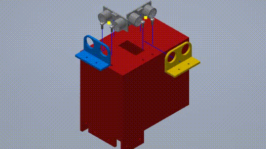

 

<h1 align="center">The Auto Aid Cart🩺</h1>

### 
 The Auto Aid Cart is an autonomous self-driving medicine cart prototype developed using C++ and built utilizing; Arduino, ultrasonic sensors, photoresistors, and servo motors.

 It features two modes for easy usability and access. The first mode allows  you to control the cart manually via the D-PAD controls on your android smartphone. The second mode makes the cart autonomous  letting it go to different rooms by its self.

### <h1 align="center"> Design 🔨</h1>
* An arduino parallax bot was used as the base of the cart and an enclosure was designed to hide wires and attach the sensors to.
* An untrosonic sensor holder along was designed and screwed to securely fasten the sensors to housing.
  * Sensor hodler was 3-D printed using MakerBot Replicator+
<h2> Blueprints 📐</h2>

 
  

